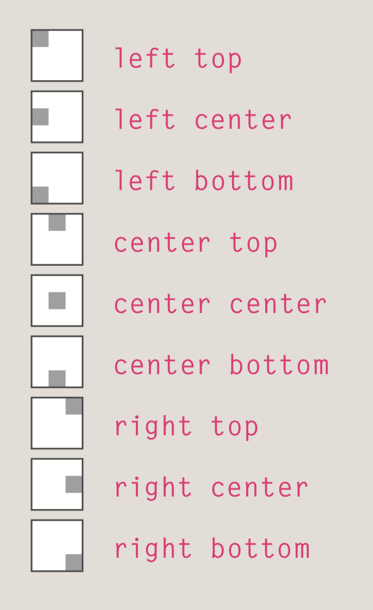

# Images & Practical Information on HTML & CSS

Images are very important elements that create a touch to your design. Controlling size of images, aligning and adding background images is important to understand how to use on CSS in order to create a clean well designed web page.

## I. Controlling Size of Images

You can control the size of an image by using the width and height properties in CSS. Specifying images by creating an *ID* or *class* can really help the page load more smoothly.

## II. Aligning & Centering Images using CSS

There are two efficient ways in **aligning** your images on CSS through the float property.

1. The float property is added to the class that was created to represent the size of the image (such as the small class in our example).
2. New classes are created with names such as align-left or align-right to align the images to the left or right of the page. These class names are used in addition to classes that indicate the size of the image.

Images are *inline* elements by default, which means they flow within the surrounding text. An image should be turned into a block-level element (*block* or*inline-block*) so you can use the display property with a value block.

Once it has been made into a block-level element, there are two common ways in which you can horizontally center an image:

1. On the containing element, you can use the text-align property with a value of center.
2. On the image itself, you can use the use the margin property and set the values of the left and right margins to auto.

## III. Background Images

The background-image property allows you to place an image behind any HTML element, which is either filled by the entire page or just part of a page. Depending on it's size,by default, a background image will keep repeating to fill the entire box. If this case happens, then we would use the following:

- background-repeat:
     repeat; The background image is repeated horizontally and vertically
     repeat-x;The image is repeated horizontally only
     repeat-y;The image is repeated vertically only.
     no-repeat;The image is shown once.
- background-attachement:
    fixed;The background image stays in the same position on the page.
    scroll;The background image moves up and down as the user scrolls up and down the page.
- background-position:

You can add image rollovers and sprites and a third style when they click on it. 