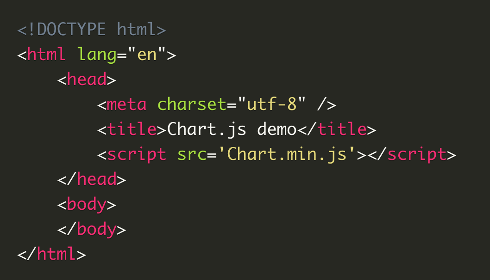

# Using Charts with Charts/Javascript

You can download the latest version of Chart.js from the GitHub 
releases or use a Chart.js CDN. You can also create stunning animated charts. They’re easier to look at and convey data quickly, but they’re not always easy to create. You must follow these steps in order to achieve your charts

## Setting up

After downloading Charts.js, copy the Chart.min.js out of the unzipped folder and into the directory you will be working on. Finally create an html page and import the following script:

## Drawing a line chart

We need to create a canvas element on HTML in order to draw a laine chart;
< canvas id="buyers" width="600" height="400">< /canvas >
Then we need to write a script that will retrieve the contect of the canvas;
< script >
var buyers = document.getElementById('buyers').getContext('2d');
    new Chart(buyers).Line(buyerData);
< /script >

## Drawing a pie chart

< canvas id="countries" width="600" height="400">< /canvas >
var countries= document.getElementById("countries").getContext("2d");
new Chart(countries).Pie(pieData, pieOptions);

## Drawing a bar chart

< canvas id="income" width="600" height="400" >< /canvas >
var income = document.getElementById("income").getContext("2d");
new Chart(income).Bar(barData);
var barData = {
labels : ["January","February","March","April","May","June"],
datasets : [
{
fillColor : "#48A497",
strokeColor : "#48A4D1",
data : [456,479,324,569,702,600]
},
{
fillColor : "rgba(73,188,170,0.4)",
strokeColor : "rgba(72,174,209,0.4)",
data : [364,504,605,400,345,320]
            }
]
}

### Applying styles & colors

fillStyle and strokeStyle are two important proerties to use in order to apply colors to shapes.

fillStyle = color (Sets the style used when filling shapes.)
strokeStyle = color (Sets the style for shapes' outlines.)