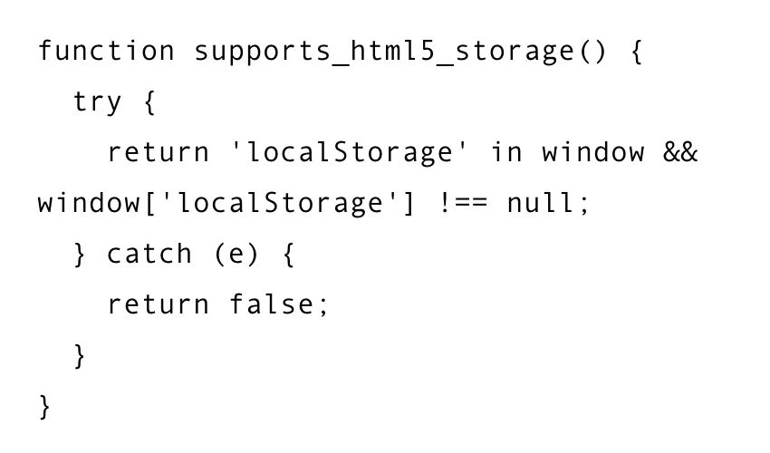
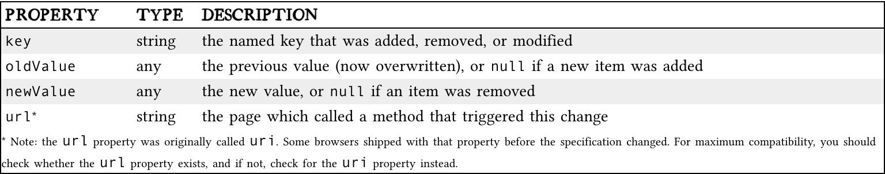

# THE PAST, PRESENT & FUTURE OF LOCAL STORAGE FOR WEB APPLICATIONS

At the beginning of time, there was only Internet Explorer, which started a First Great Browser Wars. The first Great Browser war was competition for dominance in the usage share of web browsers. Then Microsoft invented many things, which one was called the DHTML Behaviors, which sub-included a behavior called userData.

*userData* is what allows the web page to store up to 64KB of data per domain. Adobe later on created a feature that allowed us to store up to 100KB of data per domain.

## HTML5 Storage

HTML5 Storage is a specific name for Web Storage. Back in time, it was part of the HTML5 itself, then leading to a split due to political reasons. There are other names/types for storage, such as **DOM Storage** or **Local Storage**.

HTML5 Storage are a way for web pages to store named key/value pairs locally, within the client web browser.

You can access the HTML5 Storage from your JavaScript through **localStorage** object on the global window object, but will need to check whether the browser supports it.

HTML5 Storage is based on named key/value pairs. The named key is a string while the data can be any type supported by JavaScript, including strings, Booleans, integers, or floats. However, the data is actually stored as a string so if you are storing and retrieving anything other than strings, you will need to use functions like parseInt() or parseFloat() to make it adaptable to your retrieved data into the expected JavaScript.

You want to keep track of the storage, and check the history of what changes and so on by trapping the storage event. *The storage* event is fired on the window object whenever setItem(), removeItem(), or clear() is called and actually changes something. Here are key helpers for the storageEvent object

