# Transforms, Transitions and Animation (HTML&CSS)

 What Google Learned From Its Quest to Build the Perfect Team

## Transforms (HTML & CSS)

New ways to position and alter elements came in with CSS3. The **transform** property allows you to change the size, position and change elements in a new alternative way. It comes with two different settings that come with their own properties and values.

- 2D setting, elements may be distorted, or transformed on both 2D or 3D plane. 2D work on the *x* and *y* axes.
- 3D setting, work on the *x*,*y* and *z* axes.

There are several aspects we can play with, and the following are;

- Rotate (transform: rotate(40deg));
- Scale (transform: scale(1.25)); Multiple Scaling (applying the x and y)
- Translate (pushing the element without affecting the rest of content) (transform:translateXorYorBoth)
- Skew (changing the perspective) (transform: skew(5deg, -20deg);)
- Origin (another form of perspective by changing the center point) (transform: rotate(15deg); transform-origin: 0 0;})
- Perspective (perspective: 200px;)
 The 3D setting is applicable by adding a third value which is the z axes.
The transform property gives the ability to combine the values, such as:

- transform: rotate(25deg) scale(.75);
- transform: skew(10deg, 20deg) translateX(20px);

## Transitions & Animations (HTML & CSS)

You can also write behaviors for transitions and animations only using HTML and CSS without JavaScript with CSS3.

For a **transition** to take place, an element must have a change in state, and different styles must be identified for each state. The easiest way for determining styles for different states is by using the :hover, :focus, :active, and :target pseudo-classes.

### Transition

There are four transition related properties in total, including;

- transition-property
- transition-duration
- transition-timing-function, and
- transition-delay

It is important to understand that not all properties may be transitioned. The following are properties that can be transitioned.
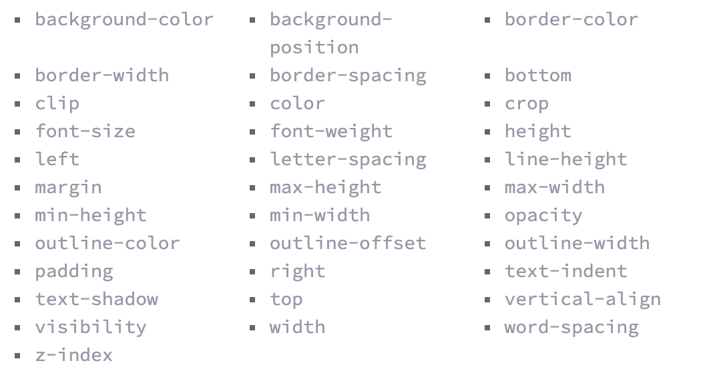

The *transition duration* is the duration in which a transition takes place.The value of this property can be set using general timing values, including seconds (s) and milliseconds (ms). These timing values may also come in fractional measurements, .2s for example.
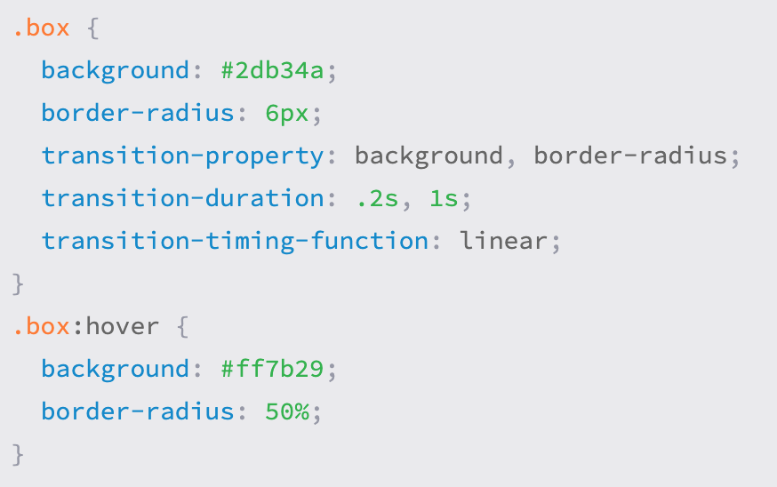
The *transition timing* property is used to set the speed at which a transition will move.
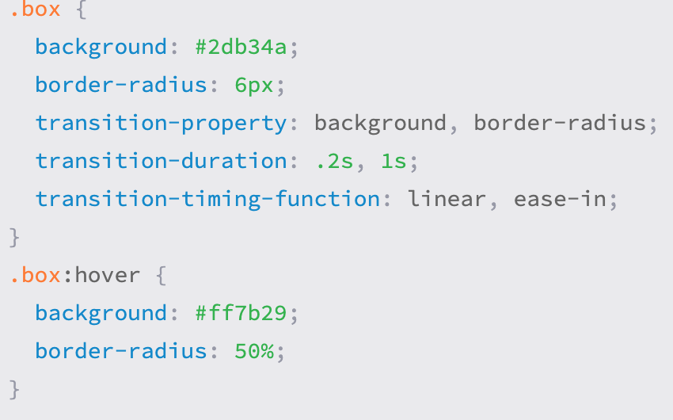
The *tranistion delay* sets a time value, seconds or milliseconds, that determines how long a transition should be stalled before executing (transition-delay: 0s, 1s;).

You can combine all the values under the transition propery such as; transition: background .2s linear, border-radius 1s ease-in 1s;

There are 8 simple CSS# transitions that will totally change the look of your website.

1. **Fade In**
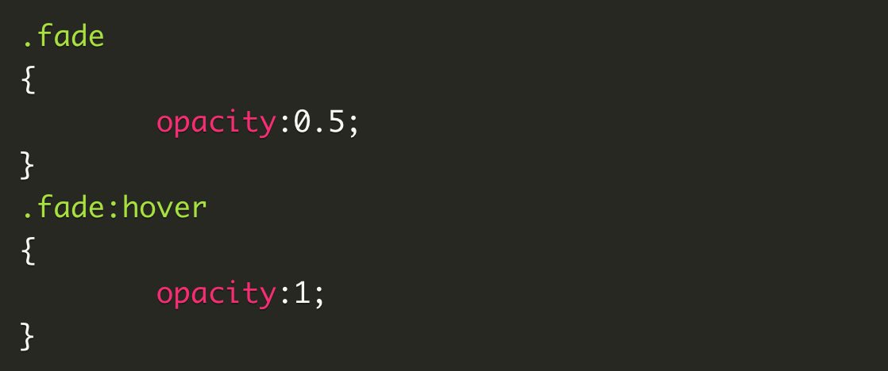
2. **Change Color**
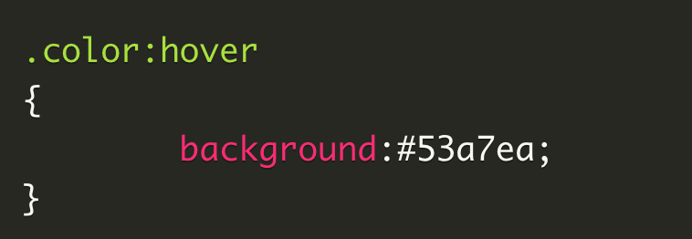
3. **Grow & Shrink**
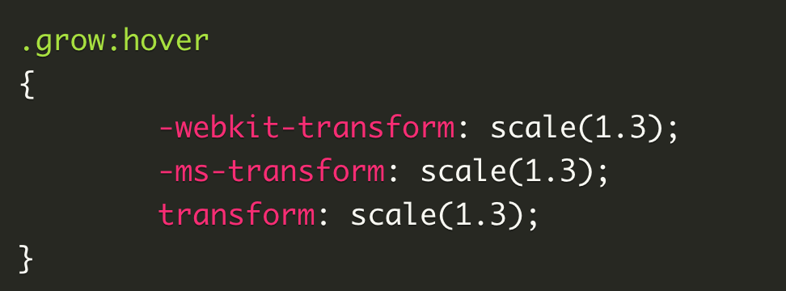
4. **Rotate Elements**
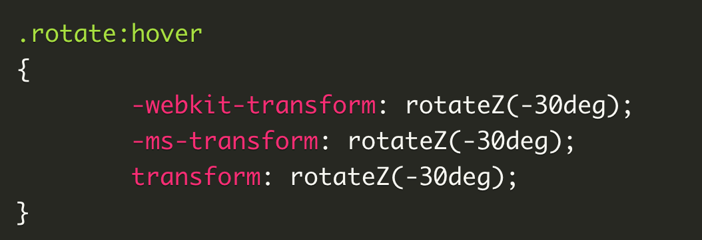
5. **Square to Circle**
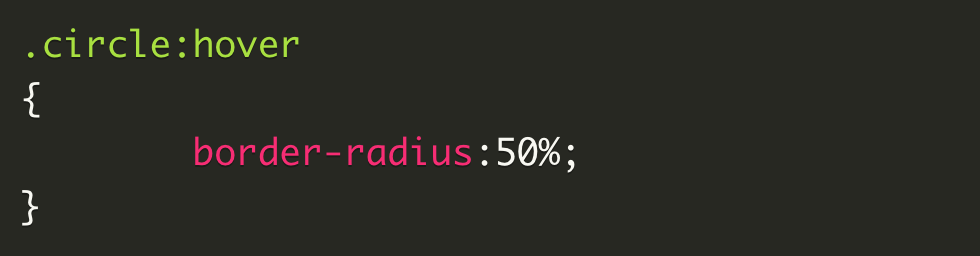
6. **3D Shadow**
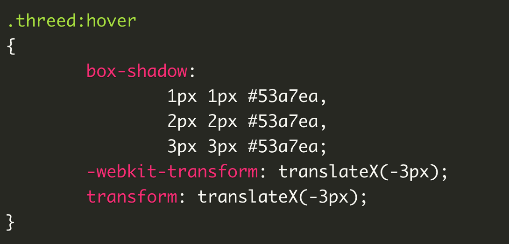
7. **Swing**
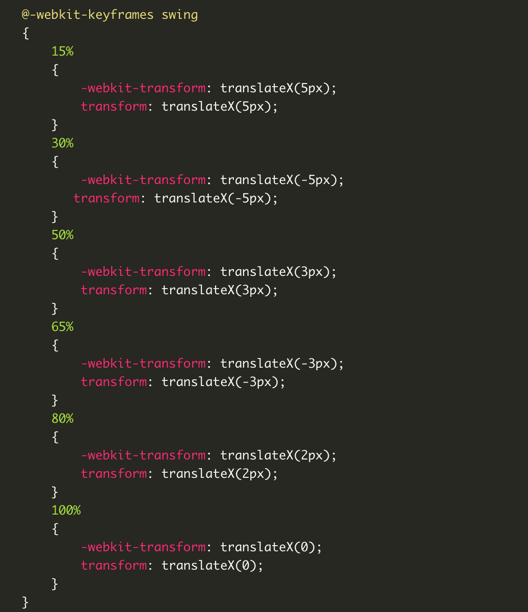
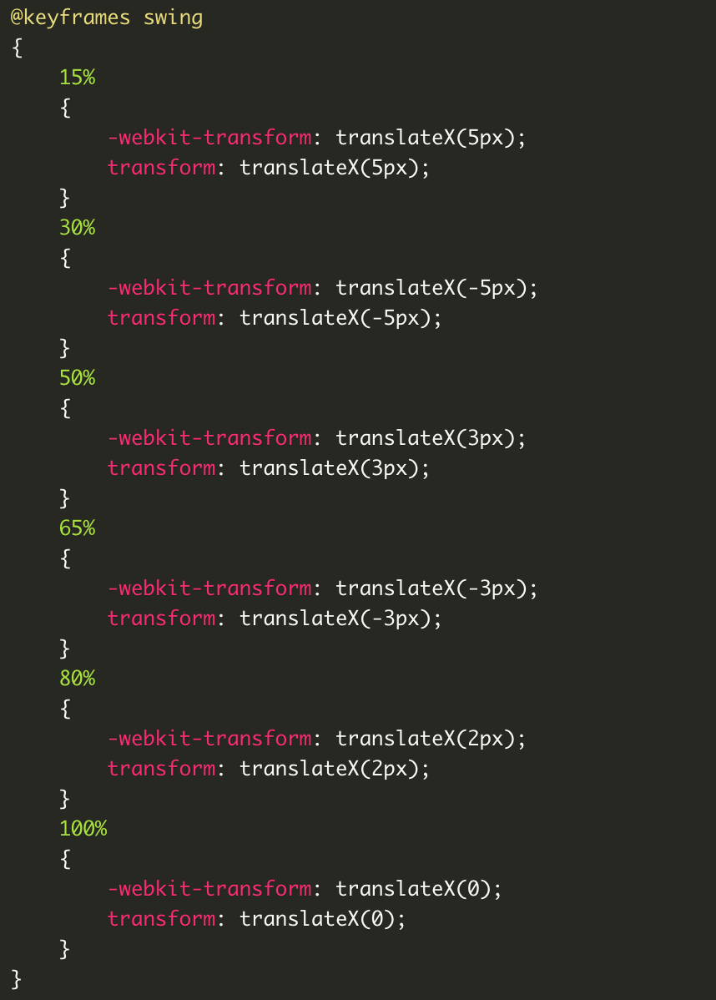
Applying the animation;
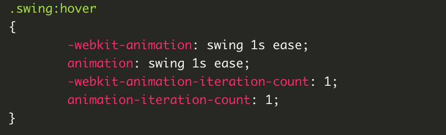
8. **Inset Border**
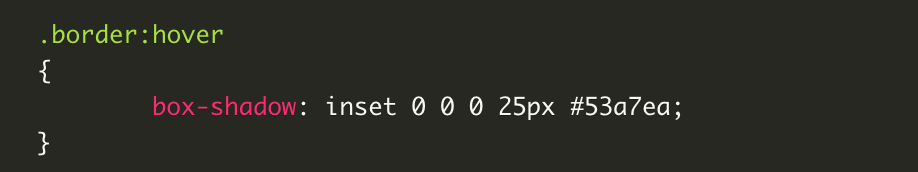

### Animation

*Animation* basically picks up where the transitions leave off.
To set multiple points at which an element should undergo a transition,we use the **@keyframes** rule, which includes the animation name, any animation breakpoints, and the properties intended to be animated.
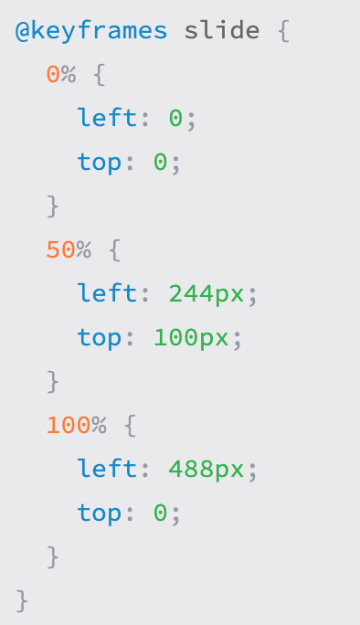

## How to build a Good Team

Being a good team-member has increased in demand and meaning over the past few years. Google learned through research and experience that there is a way to build the perfect team.

1. A good team is said to have members taking turns and having the same time to speak freely and in equal time.
2. Good team members have high *average social sensitivity* — being skilled at intuiting how others feel based on their tone of voice and expressions.
3. Respecting one another, by having all members of the team speak before the end of the group work. And more importantly being able to speak your mind and ideas without the sense of judgement between one another.
